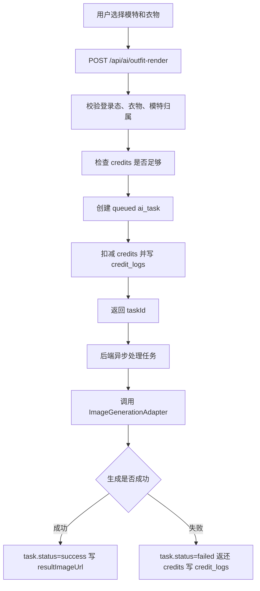

---
tags:
  - 微信小程序
  - AI试穿
  - TypeScript
  - Fastify
  - 产品笔记
created: 2026-05-13
---

# AI 衣柜微信小程序：开发清单与配置笔记

## 1. 项目一句话

这是一个 AI 穿搭试穿微信小程序：用户上传衣物图和个人模特照，选择衣物后创建 AI 试穿任务，后端异步生成结果图；生成前扣额度，失败返还额度，并且所有额度变化都写入 `credit_logs`。

核心原则：

- 小程序端负责体验、表单、上传、轮询和展示。
- 后端负责鉴权、入参校验、数据归属、额度、任务和 AI 适配。
- AI 能力必须通过 `ImageGenerationAdapter`，业务层不能直接调用具体模型。
- AI 生成任务必须异步，接口只返回 `taskId`，不能同步等待图片生成完成。
- 用户只能访问自己的数据，所有核心数据都必须带 `userId`。

## 2. 技术栈

小程序端：

- 原生微信小程序
- TypeScript
- TDesign Miniprogram
- WXML + WXSS + TS + JSON
- `utils/request.ts` 统一请求
- `utils/upload.ts` 统一上传
- `utils/feedback.ts` 统一 toast、loading、modal

后端：

- Node.js
- TypeScript
- Fastify
- Zod 参数校验
- `@fastify/cors`
- `@fastify/multipart`
- 统一响应格式

数据：

- 当前：内存 mock store
- 目标：MongoDB 风格 Schema
- 后续可迁移 PostgreSQL

AI 图片生成：

- 当前：`MockImageGenerationAdapter`
- 可切换：`ChatgptImage2Adapter`
- 统一入口：`ImageGenerationAdapter`

图片存储：

- 当前：后端本地 `uploads/` mock
- 生产：腾讯云 COS 或微信云存储

任务队列：

- 当前：`setTimeout` mock 异步处理
- 生产：BullMQ / Redis Queue / 云函数队列 / 消息队列

## 3. 当前目录结构

```text
closet/
  miniprogram/      微信原生小程序端
  server/           Node.js + TypeScript + Fastify 后端
  docs/             接口文档、预览和开发笔记
  skills/           项目开发规范
  scripts/          辅助脚本
```

小程序重点目录：

```text
miniprogram/
  app.ts
  app.json
  project.config.json
  pages/
    tryon/          AI 试穿
    closet/         我的衣柜
    inspiration/    灵感
    profile/        我的
    index/          首页
    cloth/          上传/编辑衣物
    model/          我的模特
    task/           任务等待页
    result/         结果页
    privacy/        隐私设置
  components/
  utils/
    request.ts
    upload.ts
    feedback.ts
```

后端重点目录：

```text
server/
  src/
    app.ts
    server.ts
    routes/
    plugins/
      auth.ts
      errorHandler.ts
    modules/
      auth/
      users/
      clothing-items/
      user-photos/
      uploads/
      ai/
      credits/
      privacy/
    store/
      mockStore.ts
      types.ts
    utils/
```

## 4. 本地启动配置

后端启动：

```bash
cd server
npm install
copy .env.example .env
npm run dev
```

默认后端地址：

```text
http://localhost:3000
```

健康检查：

```http
GET http://localhost:3000/health
```

小程序启动：

```bash
cd miniprogram
npm install
```

然后用微信开发者工具打开：

```text
miniprogram/
```

微信开发者工具里需要执行：

```text
工具 -> 构建 npm
```

当前小程序本地配置在 `miniprogram/app.ts`：

```ts
apiBaseUrl: "http://localhost:3000/api"
token: "mock-token-user_mock_001"
```

注意：

- 本地调试使用 mock token。
- 真机预览时，`localhost` 通常不能直接访问本机后端，需要改成电脑局域网 IP 或部署后的 HTTPS 域名。
- `project.config.json` 里当前 `urlCheck: false` 只适合本地调试，上线前必须配置合法域名并打开校验。

## 5. 微信小程序后台需要配置

基础配置：

- AppID：替换成自己的正式小程序 AppID。
- 小程序名称、头像、类目。
- 服务器域名。
- 用户隐私保护指引。

服务器域名：

- `request合法域名`：后端 API 域名，例如 `https://api.example.com`。
- `uploadFile合法域名`：图片上传域名，可能是 API 域名或 COS 域名。
- `downloadFile合法域名`：结果图、衣物图、模特图所在域名。
- 如果用 COS，还要配置 COS 的访问域名和跨域。

隐私和权限：

- 使用 `wx.chooseMedia` 前要处理隐私授权。
- 需要在微信后台填写收集的用户信息类型：头像、昵称、图片、相册/相机用途等。
- 上传个人全身照属于敏感体验，页面上要给清晰用途说明。

发布前检查：

- 关闭本地 `urlCheck: false` 的依赖。
- 后端必须 HTTPS。
- API 域名、上传域名、下载域名都在微信后台白名单里。
- 不要把 mock token、测试 AppID、第三方 API Key 放进小程序端。

## 6. 后端环境变量

当前 `server/.env.example` 的核心配置：

```env
NODE_ENV=development
PORT=3000
HOST=0.0.0.0
LOG_LEVEL=info

IMAGE_GENERATION_PROVIDER=mock

CHATGPT_IMAGE2_BASE_URL=https://image.codesonline.dev/v1
CHATGPT_IMAGE2_API_KEY=
CHATGPT_IMAGE2_MODEL=gpt-image-2
CHATGPT_IMAGE2_SIZE=9:16
CHATGPT_IMAGE2_QUALITY=high
CHATGPT_IMAGE2_STYLE=natural
CHATGPT_IMAGE2_RESPONSE_FORMAT=url
CHATGPT_IMAGE2_TIMEOUT_MS=120000

PUBLIC_BASE_URL=http://localhost:3000
UPLOAD_DIR=uploads
```

配置说明：

- `IMAGE_GENERATION_PROVIDER=mock`：使用 mock AI 生成。
- `IMAGE_GENERATION_PROVIDER=chatgpt-image-2`：切换到真实图片生成适配器。
- `CHATGPT_IMAGE2_API_KEY`：真实 AI 图片服务的密钥，只能放后端环境变量。
- `PUBLIC_BASE_URL`：图片上传后拼出来的公开访问地址。
- `UPLOAD_DIR`：本地上传文件目录，生产建议换成 COS 或云存储。

上线还需要补充：

- `JWT_SECRET` 或 session 密钥。
- 微信登录配置：`WECHAT_APP_ID`、`WECHAT_APP_SECRET`。
- 数据库连接：`DATABASE_URL` 或 MongoDB URI。
- Redis / Queue 连接。
- COS / 云存储密钥。
- 支付配置。
- 内容安全审核配置。

## 7. 统一 API 规则

统一成功响应：

```json
{
  "success": true,
  "data": {},
  "error": null
}
```

统一错误响应：

```json
{
  "success": false,
  "data": null,
  "error": {
    "code": "VALIDATION_ERROR",
    "message": "请求参数不合法",
    "details": {}
  }
}
```

鉴权规则：

- `GET /health` 不需要登录。
- `POST /api/auth/wechat-login` 不需要登录。
- 其他接口都需要：

```http
Authorization: Bearer <token>
```

当前核心接口：

```text
POST   /api/auth/wechat-login
GET    /api/users/me
POST   /api/uploads/image
POST   /api/clothing-items
GET    /api/clothing-items
DELETE /api/clothing-items/:id
POST   /api/user-photos
GET    /api/user-photos
POST   /api/ai/outfit-render
GET    /api/ai/tasks/:taskId
GET    /api/credits/logs
POST   /api/privacy/delete-account
```

接口经验：

- 所有接口入参必须用 Zod 校验。
- 所有查询都必须按 `userId` 过滤。
- 删除用户内容优先软删除。
- 列表接口后续要加分页。
- 上传接口要限制文件数量、大小、MIME 类型。

## 8. 数据模型

核心集合/表：

```text
users
clothing_items
user_photos
ai_tasks
credit_logs
```

`users`：

- `_id`
- `openid`
- `nickname`
- `avatarUrl`
- `plan`
- `credits`
- `createdAt`
- `updatedAt`
- `deletedAt`

`clothing_items`：

- `_id`
- `userId`
- `imageUrl`
- `sourceType`
- `sourceUrl`
- `category`
- `color`
- `season`
- `occasion`
- `note`
- `useCount`
- `status`
- `createdAt`
- `updatedAt`
- `deletedAt`

`user_photos`：

- `_id`
- `userId`
- `imageUrl`
- `type`
- `isActiveModel`
- `displayName`
- `auditStatus`
- `createdAt`
- `updatedAt`
- `deletedAt`

`ai_tasks`：

- `_id`
- `userId`
- `modelType`
- `modelPhotoId`
- `clothingItemIds`
- `mode`
- `scene`
- `style`
- `shareable`
- `promptVersion`
- `status`
- `resultImageUrl`
- `retryCount`
- `errorCode`
- `errorMessage`
- `costEstimate`
- `createdAt`
- `updatedAt`
- `completedAt`
- `deletedAt`

`credit_logs`：

- `_id`
- `userId`
- `change`
- `reason`
- `taskId`
- `balanceAfter`
- `createdAt`

索引建议：

- `users.openid` 唯一索引。
- 所有业务表加 `userId` 索引。
- `ai_tasks.status` 加索引，用于任务队列扫描。
- `ai_tasks.userId + createdAt` 复合索引，用于用户任务列表。
- `credit_logs.userId + createdAt` 复合索引，用于额度流水。
- 软删除字段 `deletedAt` 可配合查询索引。

数据原则：

- 所有数据必须有 `createdAt`。
- 重要数据必须有 `updatedAt`。
- 业务删除优先软删除。
- `credit_logs` 是审计流水，不允许随便删除。

## 9. 核心业务流程

### 9.1 登录

```text
小程序 wx.login
  -> 拿 code
  -> POST /api/auth/wechat-login
  -> 后端用 code 换 openid
  -> 创建或更新 user
  -> 返回 token + user
  -> 小程序保存 token
```

当前还是 mock 登录，生产必须接微信服务端。

### 9.2 图片上传

```text
选择图片
  -> 前端检查大小
  -> POST /api/uploads/image
  -> 后端检查登录态
  -> 后端检查 MIME 类型和大小
  -> 存储到本地 / COS / 云存储
  -> 返回 imageUrl + imageMeta
  -> 再创建衣物或模特记录
```

当前限制：

- 最大 5MB。
- 仅支持 `image/jpeg`、`image/png`、`image/webp`。
- 一次只上传 1 张。

### 9.3 AI 试穿任务



关键点：

- 创建任务接口返回 `202` 和 `taskId`。
- 前端跳转到任务等待页。
- 前端轮询 `GET /api/ai/tasks/:taskId`。
- 成功后跳结果页。
- 失败后展示错误，后端自动退还额度。

## 10. AI 适配层规范

只允许这样调用 AI：

```text
业务路由 -> ImageGenerationAdapter -> 具体 AI 服务
```

禁止：

- controller 直接调用 OpenAI 或其他模型服务。
- controller 里写具体模型名。
- 把用户原始输入直接拼进 prompt。
- 在日志里记录用户图片隐私信息。
- 同步等待 AI 生成完成后才返回接口。

适配器职责：

- 构建安全 prompt。
- 读取模特图和衣物图。
- 调用图片生成或图片编辑接口。
- 处理超时、限流、失败重试。
- 统一返回 `imageUrl`、`costEstimate`、`metadata`。
- 记录耗时、成本、错误码。

当前真实适配器注意点：

- `ChatgptImage2Adapter` 会下载参考图，所以图片地址必须是服务端可访问的 `http/https` 地址。
- 本地临时路径、微信临时路径、不可公网访问的地址，真实 AI 服务无法读取。
- 因此生产必须先把图片上传到 COS 或云存储，再把公网可访问 URL 传给适配器。

## 11. 额度系统

规则：

- 创建 AI 任务前检查额度。
- 成功创建任务时扣额度。
- 扣额度必须写 `credit_logs`。
- AI 任务失败时返还额度。
- 返还额度也必须写 `credit_logs`。

生产重点：

- 额度扣减和流水必须在同一个事务里。
- 任务失败退款要幂等，避免重复退款。
- `credit_logs` 要能审计每一次变化。
- 支付充值、会员赠送、管理员调整都应该写流水。

建议流水原因：

```text
signup      注册赠送
pay         购买
generate    生成扣减
refund      失败返还
admin       管理员调整
```

## 12. UI 和产品规范

整体风格：

- 白色或极浅灰背景。
- 图片优先。
- 类 Google 产品风格。
- 简洁、干净、可扫描。
- 卡片圆角 8px。
- 不要过度可爱化。
- 不要复杂装饰和花哨渐变。

页面重点：

- 首页：顶部问候、今日推荐大图、上传衣服、AI 试穿、最近生成结果。
- 衣柜：分类筛选、两列网格、右下角上传按钮。
- AI 试穿：上方模特预览、中间衣物选择、底部固定生成按钮、展示剩余额度。
- 结果页：大图优先，保存、分享、再生成。
- 我的：额度、模特、隐私、账号相关入口。

文案原则：

- 按钮用明确动词：上传、试穿、保存、分享。
- 任务等待页要告诉用户正在生成，但不要承诺绝对时间。
- 失败文案要能指导下一步，例如“生成失败，额度已返还”。

## 13. 上线前必须补齐

账号和鉴权：

- 接入真实 `wx.login`。
- 后端用 `code` 换 `openid/session_key`。
- 签发正式 token。
- 移除 mock token。

存储：

- 接入 COS 或微信云存储。
- 上传前后都校验大小和格式。
- 图片 URL 要能被后端和 AI 服务访问。
- 配置访问权限、防盗链和生命周期。

数据库：

- 替换内存 mock store。
- 建集合/表、索引、软删除字段。
- 额度扣减和流水写入要用事务。

任务队列：

- 替换 `setTimeout`。
- 支持重试、超时、失败原因、幂等处理。
- 支持任务 worker 独立部署。

AI：

- 接入真实 `ImageGenerationAdapter`。
- 增加内容安全策略。
- 增加限流、超时、重试和成本统计。
- 结果图入库并保存到稳定存储。

安全合规：

- 内容安全审核：用户上传图、AI 结果图都要审核。
- 用户隐私保护指引。
- 删除账号异步清理。
- 日志脱敏。
- 接口限流。
- 管理后台或运营审核能力。

商业化：

- 额度套餐。
- 支付回调。
- 会员权益。
- 退款和补偿策略。

## 14. 开发顺序建议

1. 先固定数据模型和接口返回格式。
2. 完成真实登录和鉴权。
3. 完成真实图片上传和存储。
4. 完成衣柜 CRUD。
5. 完成个人模特上传和审核状态。
6. 完成 AI 任务创建、轮询和结果页。
7. 接入真实任务队列。
8. 接入真实 AI 适配器。
9. 做额度事务和流水审计。
10. 加内容安全、隐私、删除账号。
11. 再做支付、会员和运营后台。

## 15. 最重要的经验

- 不要让小程序端知道 AI 模型细节，模型只存在于后端适配器配置里。
- 不要在创建 AI 任务接口里同步等结果，必须返回 `taskId`。
- 额度系统不是简单字段自减，必须配套 `credit_logs`。
- 上传图片不能只信前端校验，后端必须再校验大小、类型和格式。
- 所有接口都默认“不可信”，必须校验登录态和 `userId` 归属。
- mock 阶段可以快，但每个 mock 都要知道生产替代方案是什么。
- 真机调试和上线的最大坑通常是域名：请求域名、上传域名、下载域名、HTTPS、COS CORS。
- AI 结果失败是常态流程，不是异常边角；退款、错误提示、重试都要设计好。
- `credit_logs`、`ai_tasks`、图片审核记录属于以后排查问题的生命线，不能省。

